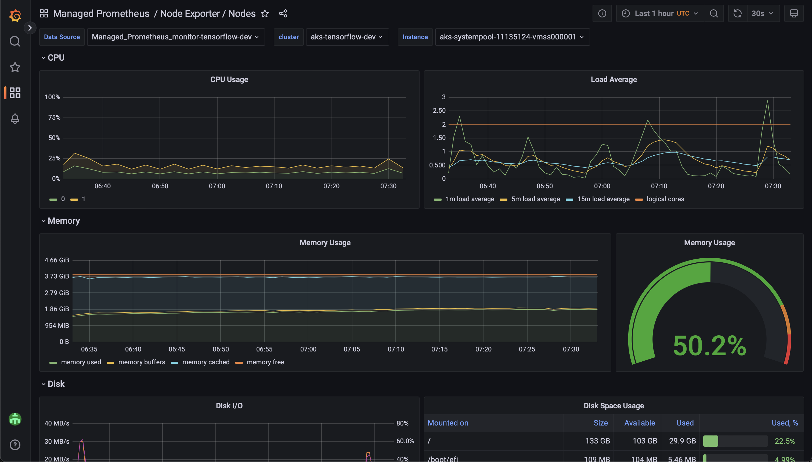
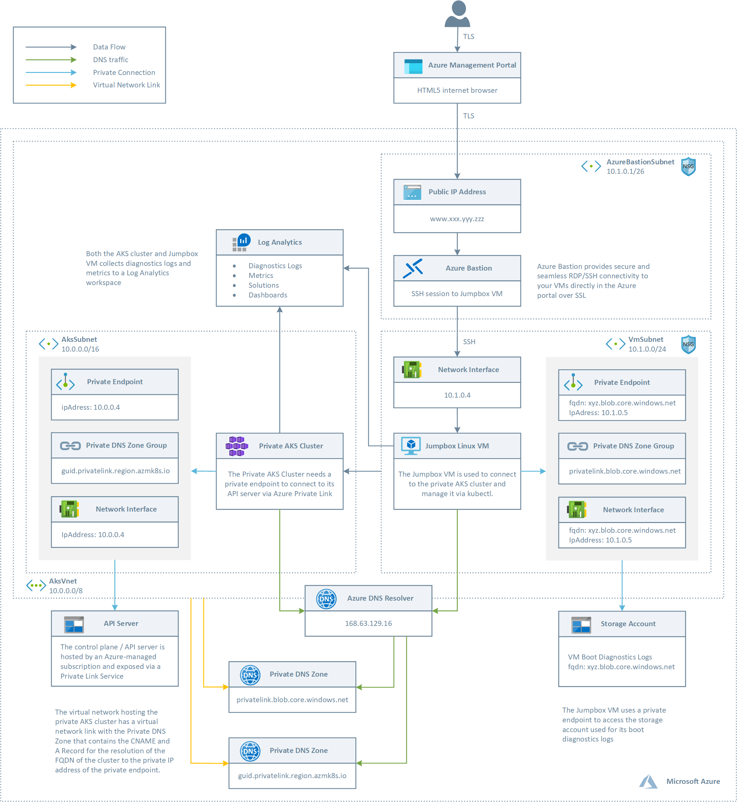

# Deploying a TensorFlow Model to Kubernetes

This provides a sample Azure Kubernetes Service architecture to deploy a TensorFlow model.





## Getting Started (Provision Cloud Infrastructure) 

1. Fork this repository into your account.

2. Launch [Cloud Shell](https://shell.azure.com/bash). (Open Link in New Tab)

```COPY``` the following line 👇
```
curl -LJO https://raw.githubusercontent.com/mattbenecky/kubernetes-tensorflow/main/src/infra/init.sh && chmod 755 init.sh && ./init.sh
```
```PASTE``` in Cloud Shell & press ```ENTER```

2. Get your GitHub secrets ready:

```CLIENT_ID```
```TENANT_ID```
```SUBSCRIPTION_ID```
```ADMIN_GROUP_ID```
```GRAFANA_GROUP_ID```

3. Deploy to Azure 

[](https://raw.githubusercontent.com/mattbenecky/kubernetes-tensorflow/main/.github/workflows/cd.yml)

## Running the App (Deploy TensorFlow Model & Monitor AKS Cluster)

1. Run GitHub workflow ```kubectl```.

2. Open Grafana.

## Cleaning Up (Delete Cloud Resources)

1. Launch [Cloud Shell](https://shell.azure.com/bash). (Open Link in New Tab)

```COPY``` the following line 👇
```
curl -LJO https://raw.githubusercontent.com/mattbenecky/kubernetes-tensorflow/main/src/infra/cleanup.sh && chmod 755 cleanup.sh && ./cleanup.sh
```
```PASTE``` in Cloud Shell & press ```ENTER```
